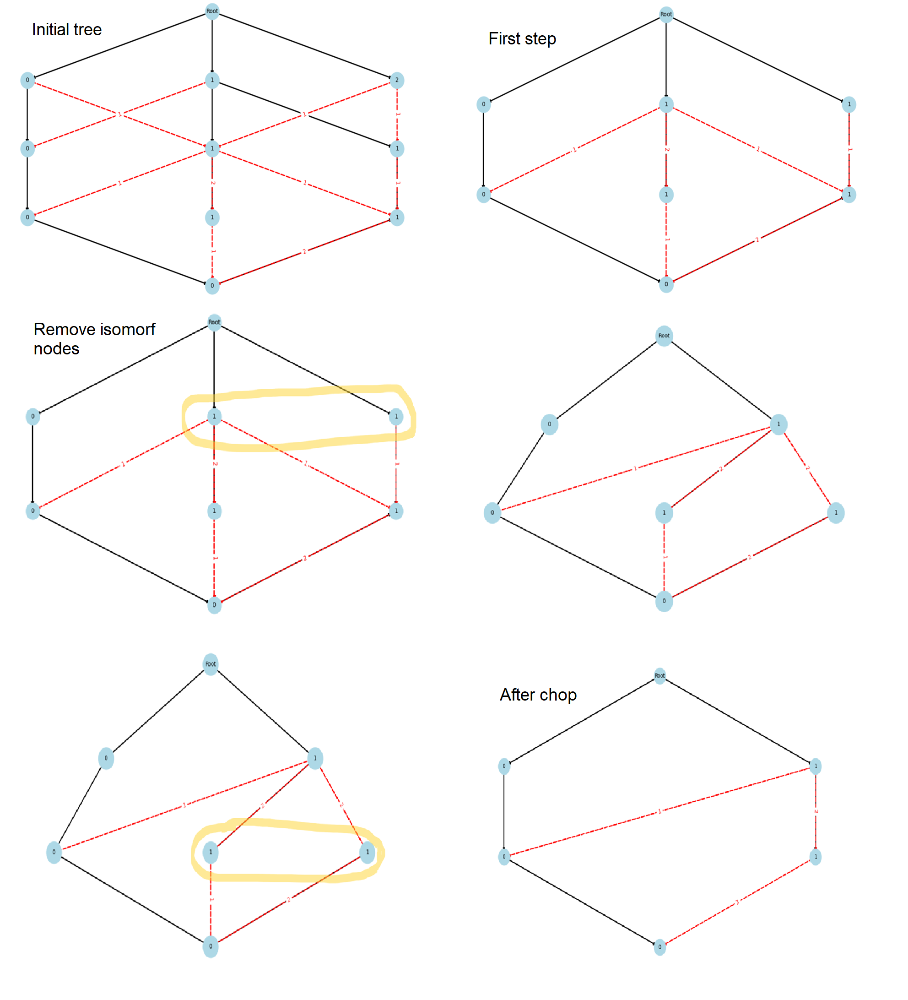
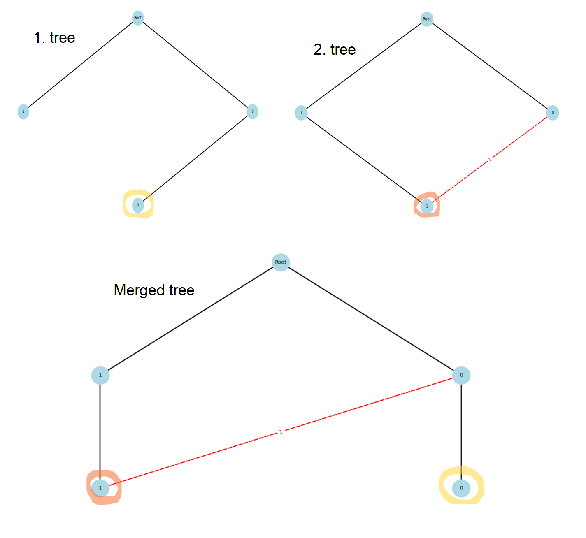
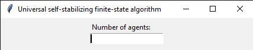
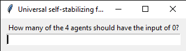
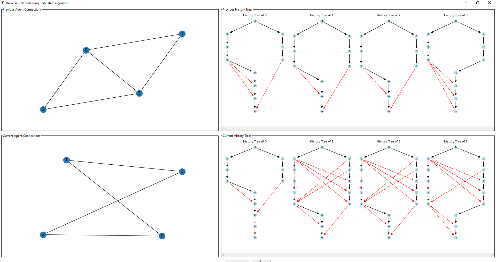
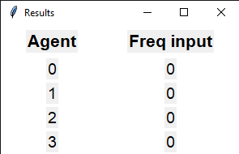

# Universal Finite-State and Self-Stabilizing Computation in Anonymous Dynamic Networks
## Introduction

This algorithm addresses the challenge of computing a global function in an anonymous and dynamic network, where agents (nodes) have no unique identifiers, and the network connections can change unpredictably over time. Traditional approaches either require infinite memory or cannot guarantee explicit termination without knowing the number of agents.

The presented algorithm overcomes these limitations by using a finite-state, self-stabilizing method. It allows agents to compute correct outputs despite memory corruption and network changes, stabilizing after a bounded number of communication rounds. The key technique is the construction and continuous update of a data structure called the history tree, which helps agents track and recover the collective state of the network over time.

This makes the algorithm particularly suited for real-world distributed systems where nodes are indistinguishable and network topology is highly dynamic.

## Algorithm

At the beginning of each round, every node sends its stored history tree to its neighbors and performs the corresponding computations, which in this case are executed by the agents' main() function. This function implements the following steps:

1. It receives the history trees from neighbors and determines the minimum height among all received trees as well as its own history tree.
2. If its own tree is taller than this minimum height, it trims (chops) the tree to match the minimum height.
3. It adds a new bottom node to its own tree containing its own input value; this becomes the new bottom node.
3. It iterates through the received messages and similarly trims the received neighbor trees if necessary, as in step 2.
4. Consequently, its own tree and the current received tree have the same height, so they can be merged using the merge operation.
5. After merging, a new node must be added to its own tree as the new bottom node, connected by a red edge. The red edge points from the corresponding node in the neighbor’s received tree to the newly added node. This represents the interaction between the agent and that neighbor.
6. Finally, to ensure stabilization occurs within the correct timeframe, if after the merge operations its own tree is taller than 2n−1, another chop operation is performed.
7. The algorithm terminates when a certain counting level is reached.

### History Trees
They represent the network’s temporal changes as a tree. The root is the starting point; other nodes represent agents’ inputs. Two edge types: black (tree structure) and red (communication). The tree shows how agents’ views evolve over time.

### Chop Operation
Removes the lowest tree level to discard old data, then merges identical nodes to avoid duplicates, helping stabilize the algorithm.

### Merge Operation
Combines identical nodes from two trees and adds new nodes so agents’ views synchronize.

### Counting Level
A tree level where each node has exactly one child. From this level, red edges allow calculation of input frequencies.

### Self-Stabilizing Algorithm
An algorithm that recovers from temporary faults automatically, reaching correct operation in finite time without external help.

## Implementation
We used Python for the implementation, leveraging several libraries to build the application. The graphical user interface was created with tkinter and its extensions (ttk, simpledialog, and messagebox) for user interaction. For visualization, we used matplotlib together with FigureCanvasTkAgg to embed plots inside the GUI. To handle network structures like history trees, we utilized the networkx library. The application follows a model-view architecture, separating data management from the user interface to maintain clear and modular code.

### Input
At the start of the simulation, the program asks the user to input two values:
1. The number of agents in the network.

    

2. How many of these agents should have an initial input value of 0.

    

The remaining agents will have their input value set to 1. This input setup initializes the agents’ states and prepares them for the execution of the algorithm.

### User Interface
The graphical user interface is divided into four main panels, each displaying a different aspect of the algorithm’s state during simulation:

+ **Current Network Graph**:
Displays the current topology of the agent network. Each node represents an agent, and the edges show active communication links for this round.

+ **Previous Network Graph**:
Shows the network topology from the previous round. This allows users to observe how the network changes over time in a dynamic setting.

+ **Current History Trees**:
Displays the updated history trees after the current round. These show how each agent integrates new information from its neighbors.

+ **Previous History Trees**:
Visualizes each agent’s history tree from the previous round. This allows comparison between consecutive rounds to observe how the local views evolve.

### Result Display
Once the algorithm has stabilized (i.e. no further changes occur in the agents’ history trees and outputs), a pop-up result panel appears. This dialog summarizes the final computed output of each agent.

## Structure

| Module  | Description                                                                                     |
|--------------|-------------------------------------------------------------------------------------------------|
| Agent        | Represents an agent with input and history tree; exchanges messages, updates tree, computes outputs until stable. |
| HistoryTree  | Manages history trees as directed multigraphs; supports adding, merging, pruning, and validation.  |
| GraphViewer  | Visualizes agents, connections, and history trees; provides simulation controls and result summaries. |
| Algorithm    | Controls simulation flow: creates agents, generates random graphs, runs rounds until stability.  |
| Main         | Launches the GUI by creating a GraphViewer instance.                                            |
| GraphCollection | Stores the previous and current graphs along with their HistoryTree lists. This data structure is provided by the algorithm to the GraphViewer for rendering the network and its history during each simulation round. |
                  